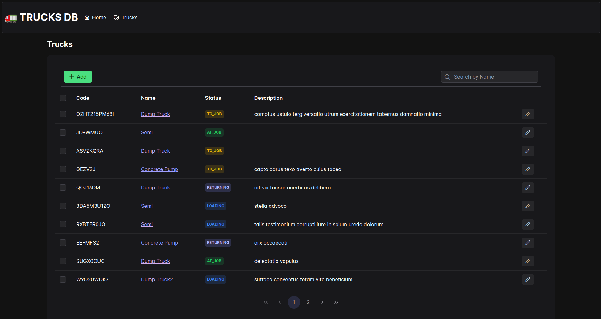

# Vue Sample App - Trucks DB

The goal of this task is to create a page with a form for managing truck data, integrated with a mock API.
This is part of the first module of an ERP application, which will eventually include modules for managing various
resources (e.g., employees, factories, customers). The user should be able to perform CRUD operations on trucks,
ensuring each truck has a unique alphanumeric code, a name, a valid status, and optionally a description,
while adhering to specific status transition rules.



## Features

- List of all trucks with pagination and search by name (only full name and case-sensitive match because of API)
- Adding new truck
- Updating truck details
- Changing truck status

### Notes

- Application's UI is based on Prime Vue.
- Tests are set up with vitest and msw for mocking http requests.
- Some simplifications have been made, but the overall requirements are met.

## Project Setup

```sh
npm install
```

### Development

```sh
npm run dev
```

### Compile for Production

```sh
npm run build
```

### Run Unit Tests

```sh
npm run test:unit
```
